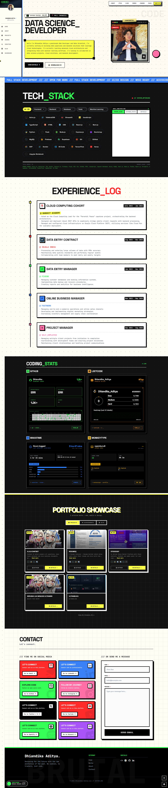

<div align="center">

.png)
<!-- GANTI IMG NANTI: Gunakan banner custom di sini -->


</div>

## 📌 Project Overview
**Portofolio Project.exe** is a modern, high-performance personal portfolio website designed with a distinct **Neo-Brutalist** aesthetic. Built on [Astro](https://astro.build/), it delivers exceptional speed and SEO performance while offering interactive features through React components.

This project serves as a showcase for development skills, projects, and technical writing, featuring a fully integrated Content Management System (CMS) for easy updates.

## ✨ Key Features
- **Neo-Brutalist Design System**: Bold typography, high contrast, and tactile UI elements.
- **Bilingual Support (i18n)**: Seamless switching between **English** and **Indonesian**.
- **Integrated CMS**: Manage **Projects**, **Blog Posts**, and **Certificates** directly via `/keystatic`.
- **Advanced Filtering**: Real-time search and tag filtering for content discovery.
- **Responsive & Accessible**: Optimized for all devices with a focus on usability.
- **Performance First**: Static Site Generation (SSG) ensures instant page loads.

## 🛠️ Technology Stack
- **Core Framework**: [Astro](https://astro.build/)
- **UI Library**: [React](https://react.dev/)
- **Styling**: [Tailwind CSS](https://tailwindcss.com/)
- **CMS**: [Keystatic](https://keystatic.com/)
- **Deployment**: Optimized for Vercel / Netlify / Static Hosting.

<!-- GANTI IMG NANTI: Update screenshot di atas dengan screenshot asli project -->

## 🚀 Getting Started

### Prerequisites
- Node.js (v18 or higher)
- npm / yarn / pnpm

### Installation

1. **Clone the repository**
   ```bash
   git clone https://github.com/your-username/portofolio_v1.git
   cd portofolio_v1
   ```

2. **Install dependencies**
   ```bash
   npm install
   ```

3. **Start Development Server**
   ```bash
   npm run dev
   ```
   Open `http://localhost:4321` to view the site.
   Open `http://localhost:4321/keystatic` to access the CMS admin panel.

## 📂 Project Structure
A brief overview of the directory layout:

```text
/
├── public/              # Static assets (fonts, images, icons)
├── src/
│   ├── components/      # Reusable UI components (Hero, Footer, Cards)
│   ├── content/         # Content Collections (Blog, Projects, Certificates)
│   ├── layouts/         # Page templates (Layout.astro)
│   ├── pages/           # Application routes & API endpoints
│   └── styles/          # Global styles & Tailwind config
└── keystatic.config.ts  # CMS Schema configuration
```
## 📸 Screenshots

|               Homepage                |
| :-----------------------------------: | 
|  | 
|     *Neo-Brutalist Section*      | 

## 📝 License
Distributed under the MIT License. See `LICENSE` for more information.

---
<div align="center">
    <strong>Built with ❤️ by Dhiandika</strong>
</div>
